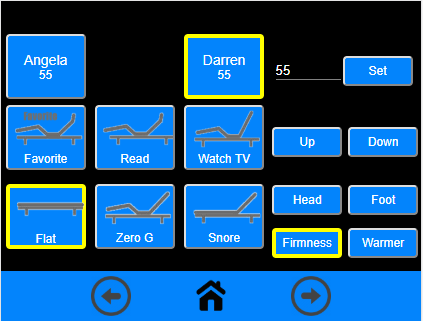

# MMM-SleepIQControl
This is a module for the [MagicMirror²](https://github.com/MichMich/MagicMirror/).

A MagicMirror module for controlling sleep number beds on a touch screen.




## Installation
### Setup the MagicMirror module
~MagicMirror/modules

git clone https://github.com/buzzkc/MMM-SleepIQControl.git


### Using the module

To use this module, add the following configuration block to the modules array in the `config/config.js` file:
```js
var config = {
    modules: [
        {
              module: "MMM-SleepIQControl",
              position: "middle_center,
              config: {
                    username: "yourSleepNumberUserName",
                    password: "yourSleepNumberPassword",
                    primarySleeper: "left", // "left" or "right"
              }
        },
    ]
}
```

### Configuration options

| Option            | Description
|-----------------  |-----------
| `username`        | *Required* Your username to login to sleepIQ
| `password`        | *Required* Your password to login to sleepIQ
| `title`           | *Optional* Title for the module
| `updateInterval`  | *Optional* Update frequency, default: 300000 <*Int*> (5 minutes)
| `primarySleeper`  | *Optional* Primary Sleeper to display, 'left' or 'right', default: 'left'
|                   |

## Known Issues
If using this with other modules that hide, the hide function of MagicMirror uses opacity to hide modules. This leaves the pointer events on hidden modules sometimes overlaying the MMM-SleepIQControl touch buttons. My current custom.css is below, but adding the "pointer-event: none;" to each of the other modules seems to work around the issue. I'm investigating if the hideModule() can be overridden to use "display:none;" instead.
```css
body {
    margin: 0px;
    height: 100%;
    width: 100%;
    cursor: default;
}

.region.fullscreen {
	position: absolute;
	top: 0px;
	left: 0px;
	right: 0px;
	bottom: 0px;
	pointer-events: none;
  z-index: 0;
}

.MMM-MyCommute {
	width: 80%;
	margin-left: 10%;
}

.clock {
  pointer-events: none;
}

.MMM-MyCommute {
  pointer-events: none;
}

.currentweather {
  pointer-events: none;
}
```

## Future enhancements
* Add SleepNumber adjustment (duh)
* ~~Add Sleeper selector~~
* Add Foot warmer options
* Add Massage options
* Add Light options

## Thanks To
* MichMich for developing [MagicMirror<sup>2</sup>](https://github.com/MichMich/MagicMirror)
* DeeeeLAN for the [API.js](https://github.com/DeeeeLAN/homebridge-sleepiq/blob/master/API.js) library
